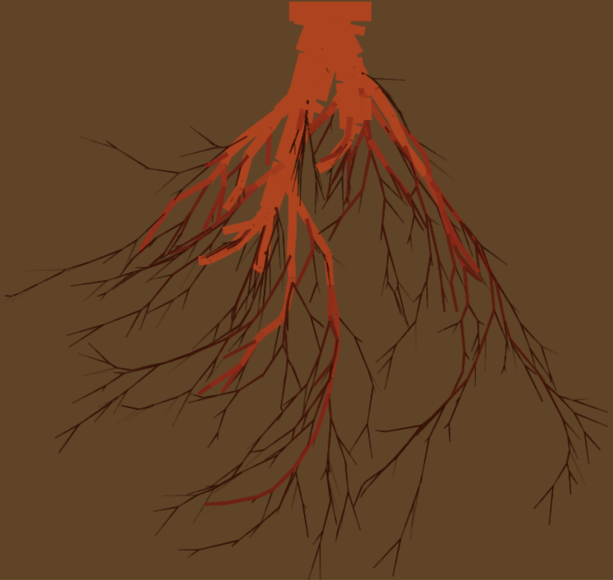

# ChatGPT Prompts for Root Generation (o3-mini-high)

I used a series of prompts with the `o3-mini-high` model in ChatGPT to produce code to explore an idea I had for visually replicating branching structure from a branch I picked up on a walk. 

ChatGPT has its limitations with code generation, but when I specify exactly what I want and I have the code literacy and library familiarity to modify what I get and make pointed counter-prompts, I'm able to get working examples. 

## Table of Contents

1. [root1](#root1)
2. [root2](#root2)
3. [root3](#root3)
4. [root4](#root4)
5. [root5](#root5)
6. [root6](#root6)
7. [root7](#root7)
8. [root8](#root8)
9. [root9](#root9)

## root1


[root1.html](root1.html) ([view](https://nrrb.github.io/visual-explorations/roots/root1.html))

```
I want to build an app with javascript. I want to generate a random tree data structure. Each node has a random length property between 1.0 and 10.0. Each node also has a width property. The root node has a width of 1.0. Each node links to two new nodes or no nodes. If the node's width > 0.1, then there are two new nodes. Each of the new nodes has a random length property between 1.0 and 10.0, and the total width of the two nodes is not greater than 1.5 times the width of the parent node.  The width of each of the nodes is randomly assigned, given a random partition of 1.5 times the parent node's width. A node will link to 0 nodes if that node's width is <= 0.1. 

I want to then visualize that tree structure where each node represents a line width length and width following the properties of that node. I want them to be drawn downwards and self-avoiding, like a plant root structure or upside-down tree.
```

## root2


[root2.html](root2.html) ([view](https://nrrb.github.io/visual-explorations/roots/root2.html))

This is the result of a couple prompts.

```
Re-do this rendering so that the lines avoid intersecting each other.
```

Then I wanted to change the way the child roots have their widths determined, based on my hypothesis that there's a volume of water+nutrients that can flow through a given parent root of width W and that the child roots r_1 and r_2 with widths w_1 and w_2 should have an equal sum of flow as the parent root. Since the parent root's flow is proportional to the area of its cross-section $`pi*(W/2)^2`$ then the child roots widths should satisfy this equation:

$`pi*(w_1/2)^2 + pi*(w_2/2)^2 = pi*(W/2)^2`$

Which can be simplified to:

$`(pi/4)*w_1^2 + (pi/4)*w_2^2 = (pi/4)*W^2`$

Factoring out the constant $`pi/4`$, we find that the sum of the squares of the child roots should equal the square of the parent root. 

The easiest way for me to explain this to ChatGPT was to modify the code, provide it back to it, and let it understand what I did and update future code. 


```
I've updated the code as follows:

<!DOCTYPE html>
<html>
<head>
  <meta charset="UTF-8">
  <title>Non-Intersecting Random Tree Visualization</title>
  <style>
    body { margin: 0; }
    canvas { display: block; margin: auto; background: #f9f9f9; }
  </style>
</head>
<body>
  <canvas id="canvas" width="800" height="600"></canvas>
  <script>
    // Global list to store all drawn segments for collision checking
    let segments = [];

    // Generate a random length between 1.0 and 10.0
    function getRandomLength(min, max) {
      return Math.pow(Math.random(), 2) * (max - min) + min;
    }

    // Recursively generate a tree node with a random length and given width.
    // If width > 0.1, the node spawns two children whose total width is 1.5 times the parent's.
    function generateNode(width) {
      let node = {
        length: getRandomLength(5.0, 50.0),
        width: width,
        children: []
      };

      if (width > 0.1) {
        let flowFriction = 0.99;
        // flow is measured by the cross-section, so flow is proportional to
        // the area computed by Math.PI * (width/2)**2. 
        let remainingFlow = flowFriction * Math.PI * ((width / 2)**2);
        let leftFlow = Math.pow(Math.random(), 2) * remainingFlow;
        let rightFlow = remainingFlow - leftFlow;
        let leftWidth = Math.sqrt(4 * leftFlow / Math.PI);
        let rightWidth = Math.sqrt(4 * rightFlow / Math.PI);
        node.children.push(generateNode(leftWidth));
        node.children.push(generateNode(rightWidth));
      }
      return node;
    }

    // Helper function to test if two segments (p1->p2 and p3->p4) intersect.
    // Endpoints that match are not considered intersections.
    function ccw(xA, yA, xB, yB, xC, yC) {
      return (yC - yA) * (xB - xA) > (yB - yA) * (xC - xA);
    }
    function segmentsIntersect(x1, y1, x2, y2, x3, y3, x4, y4) {
      // Skip checking if endpoints are shared.
      if ((x1 === x3 && y1 === y3) || (x1 === x4 && y1 === y4) ||
          (x2 === x3 && y2 === y3) || (x2 === x4 && y2 === y4)) {
        return false;
      }
      return (ccw(x1, y1, x3, y3, x4, y4) !== ccw(x2, y2, x3, y3, x4, y4)) &&
             (ccw(x1, y1, x2, y2, x3, y3) !== ccw(x1, y1, x2, y2, x4, y4));
    }

    // Given a starting point (x, y), a base angle, and a branch length,
    // this function attempts to find a candidate angle (within a range around the desired offset)
    // that does not cause the new segment to intersect any existing segments.
    // 'sign' is +1 for the left branch (angle offset added) and -1 for the right branch.
    function findValidAngle(x, y, baseAngle, length, segments, desiredOffset, sign) {
      let candidateAngles = [];
      // Try offsets in a range of ±0.3 radians (step size 0.05)
      for (let delta = -0.3; delta <= 0.3; delta += 0.05) {
        candidateAngles.push(baseAngle + sign * (desiredOffset + delta));
      }
      // Check each candidate angle.
      for (let angle of candidateAngles) {
        let testX = x + length * Math.cos(angle);
        let testY = y + length * Math.sin(angle);
        let valid = true;
        for (let seg of segments) {
          if (segmentsIntersect(x, y, testX, testY, seg.x1, seg.y1, seg.x2, seg.y2)) {
            valid = false;
            break;
          }
        }
        if (valid) {
          return angle;
        }
      }
      return null; // No valid angle found
    }

    // Recursively draw the tree. Each node is drawn as a line starting at (x, y) in direction 'angle'.
    // Before drawing a branch for a child, we check for intersections with previously drawn segments.
    function drawTree(ctx, x, y, angle, node) {
      let endX = x + node.length * Math.cos(angle);
      let endY = y + node.length * Math.sin(angle);

      // Record this segment so future branches can check against it.
      segments.push({ x1: x, y1: y, x2: endX, y2: endY });

      ctx.lineWidth = node.width * 10; // Scale factor for visibility
      ctx.beginPath();
      ctx.moveTo(x, y);
      ctx.lineTo(endX, endY);
      ctx.stroke();

      if (node.children.length === 2) {
        // For the left branch, choose a desired offset randomly between 0.2 and 0.7 radians.
        let desiredOffsetLeft = 0.2 + Math.random() * 0.5;
        let leftAngle = findValidAngle(endX, endY, angle, node.children[0].length, segments, desiredOffsetLeft, +1);
        // For the right branch, do the same but with a negative sign.
        let desiredOffsetRight = 0.2 + Math.random() * 0.5;
        let rightAngle = findValidAngle(endX, endY, angle, node.children[1].length, segments, desiredOffsetRight, -1);
        
        if (leftAngle !== null) {
          drawTree(ctx, endX, endY, leftAngle, node.children[0]);
        }
        if (rightAngle !== null) {
          drawTree(ctx, endX, endY, rightAngle, node.children[1]);
        }
      }
    }

    window.onload = function() {
      let canvas = document.getElementById('canvas');
      let ctx = canvas.getContext('2d');
      ctx.strokeStyle = 'black';
      
      // Clear segments for a new drawing
      segments = [];
      // Generate the random tree starting with a root width of 1.0
      let tree = generateNode(1.0);

      // Start drawing from the top center of the canvas.
      let startX = canvas.width / 2;
      let startY = 50;
      let startAngle = Math.PI / 2; // Pointing downward

      drawTree(ctx, startX, startY, startAngle, tree);
    };
  </script>
</body>
</html>
```
## root3


[root3.html](root3.html) ([view](https://nrrb.github.io/visual-explorations/roots/root3.html))

It did remarkably well with this simple prompt:

```
Add animation
```

## root4


[root4.html](root4.html) ([view](https://nrrb.github.io/visual-explorations/roots/root4.html))

I added re-generation with clicks and spacebar next. 

```
Add functionality that if you click on the canvas, it clears the canvas and draws a new tree
```

```
Change the event listener to listen for the space bar behind pressed too
```

## root5 


[root5.html](root5.html) ([view](https://nrrb.github.io/visual-explorations/roots/root5.html))

For this modification, I did some manual modifications. I changed the initial thickness of the root, the animation delay from 500ms to 100ms, and the parameters for random size of the sub-roots. I did start with this prompt:

```
Make the canvas take up the entire viewport and make it responsive to work on mobile or PC screens
```

## root6



[root6.html](root6.html) ([view](https://nrrb.github.io/visual-explorations/roots/root6.html))

```
Make the line segments the color of a carrot, and the background of the page to look like a cross-section of soil
```

It looked bad so I gave it this additional prompt:

```
Get rid of the gradient, make the background dark sienna. And the line segments are not correctly colored.
```

```
Make the background of the canvas dark brown, not the page background.
```

It still didn't look how I wanted, so I got a color palette image from [coolors](https://coolors.co/), provided it to ChatGPT, and asked it to use those colors insteaad:

```
Compose a palette of five non-white dominant colors from the attached image.
```

```
Map these colors to the line segments, where the thicker the line segment gets closer to color 5, and the thinner the line segment, the closer it is to color 1.
```

```
Implement the code for the smooth blending and show me the entire program's updated code
```

```
Discard the lightest color
```

## root7


[root7.html](root7.html) ([view](https://nrrb.github.io/visual-explorations/roots/root7.html))

For this one, I didn't think the carrot/soil colors were quite working so I switched to another color scheme using a reference image, and I wanted it to animate faster.

```
Update the palette to these five colors, and change the canvas background to white.
```

```
Change the animation duration to 50 ms and the starting width of the root to be 10
```

## root8


[root8.html](root8.html) ([view](https://nrrb.github.io/visual-explorations/roots/root8.html))

I decided I liked the carrot-ish root colors but not the soil color, so I brought it back:

```
Change the palette to be from dark orange to dark orange-red, from the max to min width of root
```

I noticed that all the roots seemed to be curving clockwise making lopsided root systems, so I asked it:

```
Why does this code generally render root structures that curl clockwise: 

<!DOCTYPE html>
<html>
<head>
  <meta charset="UTF-8">
  <title>Animated Smooth-Blended Tree (Rounded Ends, Fast Animation, Wide Root)</title>
  <style>
    html, body {
      margin: 0;
      padding: 0;
      width: 100%;
      height: 100%;
      background-color: #ffffff; /* Page background */
    }
    /* The canvas has a dark brown background */
    canvas {
      display: block;
      background-color: #654321;
    }
  </style>
</head>
<body>
  <canvas id="canvas"></canvas>
  <script>
    /********************************************************************
     * 1. Color Interpolation Utilities
     ********************************************************************/
    // Updated array of color stops (from darkest to a mid-tone), discarding the lightest color.
    const colorStops = [
      { stop: 0.0,  color: "#220901" },
      { stop: 0.33, color: "#621708" },
      { stop: 0.50, color: "#941B0C" },
      { stop: 1.0,  color: "#BC3908" }
    ];

    // Parse a hex color string (e.g., "#220901") into [r, g, b]
    function parseHexColor(hex) {
      if (hex.startsWith("#")) {
        hex = hex.slice(1);
      }
      const r = parseInt(hex.slice(0, 2), 16);
      const g = parseInt(hex.slice(2, 4), 16);
      const b = parseInt(hex.slice(4, 6), 16);
      return [r, g, b];
    }

    // Linear interpolation for numbers
    function lerp(a, b, t) {
      return a + (b - a) * t;
    }

    // Linear interpolation for two hex colors
    function lerpColor(colorA, colorB, t) {
      const [r1, g1, b1] = parseHexColor(colorA);
      const [r2, g2, b2] = parseHexColor(colorB);
      const r = Math.round(lerp(r1, r2, t));
      const g = Math.round(lerp(g1, g2, t));
      const b = Math.round(lerp(b1, b2, t));
      return `rgb(${r}, ${g}, ${b})`;
    }

    // Given a fraction f in [0..1], return a color by interpolating
    // between the nearest color stops.
    function getSmoothColorForFraction(f) {
      f = Math.max(0, Math.min(1, f)); // clamp to [0, 1]
      for (let i = 0; i < colorStops.length - 1; i++) {
        const c1 = colorStops[i];
        const c2 = colorStops[i + 1];
        if (f >= c1.stop && f <= c2.stop) {
          const localT = (f - c1.stop) / (c2.stop - c1.stop);
          return lerpColor(c1.color, c2.color, localT);
        }
      }
      // If f is exactly 1 or due to rounding issues, return the last color.
      return colorStops[colorStops.length - 1].color;
    }

    // Convert a lineWidth into a fraction and return the smooth-blended color.
    function getSmoothColorForLineWidth(lineWidth) {
      const MAX_LINE_WIDTH = 10;  // Adjust if necessary.
      const fraction = Math.min(lineWidth, MAX_LINE_WIDTH) / MAX_LINE_WIDTH;
      return getSmoothColorForFraction(fraction);
    }

    /********************************************************************
     * 2. Tree Generation & Rendering
     ********************************************************************/
    // Global list to store drawn segments for collision checking.
    let segments = [];

    // Resize the canvas to take up the entire viewport.
    function resizeCanvas(canvas) {
      canvas.width = window.innerWidth;
      canvas.height = window.innerHeight;
    }

    // Generate a random length (power-law skewed).
    function getRandomLength(min, max) {
      return Math.random() * (max - min) + min;
    }

    // Recursively generate a tree node using a flow-based partition for child widths.
    function generateNode(width) {
      let node = {
        length: getRandomLength(5.0, 50.0),
        width: width,
        children: []
      };

      if (width > 0.1) {
        let flowFriction = 0.99;
        // Flow is proportional to cross-sectional area: π * (width/2)^2.
        let remainingFlow = flowFriction * Math.PI * Math.pow(width / 2, 2);
        let leftFlow = Math.pow(Math.random(), 2) * remainingFlow;
        let rightFlow = remainingFlow - leftFlow;
        let leftWidth = Math.sqrt(4 * leftFlow / Math.PI);
        let rightWidth = Math.sqrt(4 * rightFlow / Math.PI);
        node.children.push(generateNode(leftWidth));
        node.children.push(generateNode(rightWidth));
      }
      return node;
    }

    // Collision detection helpers.
    function ccw(xA, yA, xB, yB, xC, yC) {
      return (yC - yA) * (xB - xA) > (yB - yA) * (xC - xA);
    }
    function segmentsIntersect(x1, y1, x2, y2, x3, y3, x4, y4) {
      // Endpoints that match are not considered intersections.
      if ((x1 === x3 && y1 === y3) || (x1 === x4 && y1 === y4) ||
          (x2 === x3 && y2 === y3) || (x2 === x4 && y2 === y4)) {
        return false;
      }
      return (ccw(x1, y1, x3, y3, x4, y4) !== ccw(x2, y2, x3, y3, x4, y4)) &&
             (ccw(x1, y1, x2, y2, x3, y3) !== ccw(x1, y1, x2, y2, x4, y4));
    }

    // Find a valid angle that does not intersect existing segments.
    function findValidAngle(x, y, baseAngle, length, segments, desiredOffset, sign) {
      let candidateAngles = [];
      for (let delta = -0.3; delta <= 0.3; delta += 0.05) {
        candidateAngles.push(baseAngle + sign * (desiredOffset + delta));
      }
      for (let angle of candidateAngles) {
        let testX = x + length * Math.cos(angle);
        let testY = y + length * Math.sin(angle);
        let valid = true;
        for (let seg of segments) {
          if (segmentsIntersect(x, y, testX, testY, seg.x1, seg.y1, seg.x2, seg.y2)) {
            valid = false;
            break;
          }
        }
        if (valid) {
          return angle;
        }
      }
      return null;
    }

    // Animate drawing a branch.
    function animateBranch(ctx, startX, startY, endX, endY, width, duration, callback) {
      let startTime = null;
      // Determine the smooth blended color based on line width.
      const strokeColor = getSmoothColorForLineWidth(width);

      function animateStep(timestamp) {
        if (!startTime) startTime = timestamp;
        let progress = (timestamp - startTime) / duration;
        if (progress > 1) progress = 1;

        let currentX = startX + (endX - startX) * progress;
        let currentY = startY + (endY - startY) * progress;

        ctx.lineWidth = width;
        ctx.strokeStyle = strokeColor;
//        ctx.lineCap = "round";  // Rounded line ends.
        ctx.beginPath();
        ctx.moveTo(startX, startY);
        ctx.lineTo(currentX, currentY);
        ctx.stroke();

        if (progress < 1) {
          requestAnimationFrame(animateStep);
        } else {
          callback();
        }
      }
      requestAnimationFrame(animateStep);
    }

    // Recursively animate the tree.
    function animateTree(ctx, x, y, angle, node, callback) {
      let endX = x + node.length * Math.cos(angle);
      let endY = y + node.length * Math.sin(angle);

      segments.push({ x1: x, y1: y, x2: endX, y2: endY });

      let duration = 50;  // Reduced duration (50 ms per branch)
      animateBranch(ctx, x, y, endX, endY, node.width * 10, duration, function() {
        if (node.children.length === 2) {
          let desiredOffsetLeft = -0.2 + Math.random() * 0.5;
          //let desiredOffsetLeft = 0;
          let leftAngle = findValidAngle(endX, endY, angle, node.children[0].length, segments, desiredOffsetLeft, +1);

          let desiredOffsetRight = -0.2 + Math.random() * 0.5;
          //let desiredOffsetRight = 0;
          let rightAngle = findValidAngle(endX, endY, angle, node.children[1].length, segments, desiredOffsetRight, -1);

          let pending = 0;
          function childDone() {
            pending--;
            if (pending === 0 && callback) {
              callback();
            }
          }
          if (leftAngle !== null) {
            pending++;
            animateTree(ctx, endX, endY, leftAngle, node.children[0], childDone);
          }
          if (rightAngle !== null) {
            pending++;
            animateTree(ctx, endX, endY, rightAngle, node.children[1], childDone);
          }
          if (pending === 0 && callback) {
            callback();
          }
        } else {
          if (callback) {
            callback();
          }
        }
      });
    }

    /********************************************************************
     * 3. Main Initialization
     ********************************************************************/
    window.onload = function() {
      let canvas = document.getElementById('canvas');
      let ctx = canvas.getContext('2d');

      resizeCanvas(canvas);

      function drawNewTree() {
        ctx.clearRect(0, 0, canvas.width, canvas.height);
        segments = [];

        // Generate a new tree with a root width of 10.
        let tree = generateNode(10.0);
        let startX = canvas.width / 2;
        let startY = 50;
        let startAngle = Math.PI / 2;

        animateTree(ctx, startX, startY, startAngle, tree, () => {
          console.log("Tree animation complete!");
        });
      }

      drawNewTree();

      canvas.addEventListener("click", () => {
        drawNewTree();
      });

      document.addEventListener("keydown", (event) => {
        if (event.code === "Space") {
          drawNewTree();
        }
      });

      window.addEventListener("resize", () => {
        resizeCanvas(canvas);
        drawNewTree();
      });
    };
  </script>
</body>
</html>
```

It gave me a thorough explanation, so I suggested one of the options it gave me:

```
Change the code to check all candidate angles and then pick one randomly
```

It still looked thin, so I asked it:

```
Update the code so that each node randomly branches into between zero and four nodes
```

It had forgotten the sizing of the roots from my earlier code, so I prompted it in plain english to go back, which it interpreted and implemented correctly:

```
The sum of the squares of each of the children nodes widths must equal the square of the parent node’s width
```

## root9


[root9.html](root9.html) ([view](https://nrrb.github.io/visual-explorations/roots/root9.html))

The only change here was manual, to make the root system go from white to black on a black background.